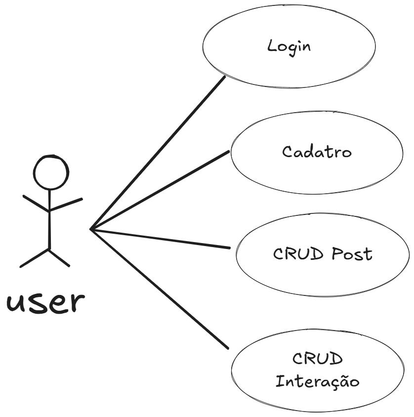

# Tribook

Rede social para o [Trilha](https://www.trilhaufpb.com).

## Diagramas

### Diagrama de Caso de Uso

### Diagrama de Classes

)

## Padrões

### Adapter

A escolha dos [models](/src/model/model.py) utiliza-se do padrão **Adapter**. Os models recebem parâmetros dos usuários, via API, e transforma esses em uma interface reconhecida pela biblioteca [SQLModel](https://sqlmodel.tiangolo.com/).

### Factory

Tendo em vista, a necessidade de geração de endpoints semelhantes, porém, com vriáveis criamos o [CRUDRouteFactory](./src/route/factory.py#L16).
